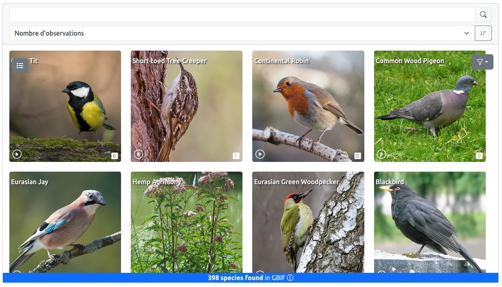

# Biodiversity around me 🐛🐦🌱

**Biodiversity around me** is a web widget that retrieves and displays species observed within a selected area.  
It supports multiple sources of biodiversity data such as [GBIF](https://www.gbif.org/) 🦋 and a [GeoNature](https://geonature.fr/) instance 🌱, with plans for additional sources.  
The widget provides several display modes, including map 🗺️, species list 📋.

The widget is built using Vue.js 3 ⚡, Turf.js ⿻, Leaflet🗺️, and Bootstrap 🅱.  
It supports multilingual interfaces 🌐 and a modern design.

## ✨ Features

- Display species found in a defined area using data from GBIF and GeoNature.
- Multiple display modes: map 🗺️, list 📋
- Sort 🔃 and filter species lists.
- Search 🔎 and filter taxons.
- Share research via link 🔗 or embed in your website 🖥️.
- Multilingual support 🌐.
- Based only on open API ! No server required (except for self-hosting) !

## 🚀 Generate your widget !

Generate your widget -> [https://pnx-si.github.io/widget-gtsi/#/config](https://pnx-si.github.io/widget-gtsi/#/config)

## 🔗 Data Sources

- **GBIF**: Global Biodiversity Information Facility API.
- **GeoNature**: A naturalist data collect self-hosted platform

## 🖼️ Display Options

- Map view 🗺️
  <br/>
  

- List of species 📋
  <br/>
  

## 🎛️ Widget customization

Each parameter can be set via URL query or through the widget’s configuration interface [/config](https://pnx-si.github.io/widget-gtsi/#/config).

| Parameter          | Type    | Purpose / Usage                                                                                                                                                                                                         | Example / Values         |
| ------------------ | ------- | ----------------------------------------------------------------------------------------------------------------------------------------------------------------------------------------------------------------------- | ------------------------ |
| `radius`           | number  | Buffer radius for search area (km)                                                                                                                                                                                      | `1`                      |
| `wkt`              | string  | [Well-Know Text](https://fr.wikipedia.org/wiki/Well-known_text) geometry (search area)                                                                                                                                  | `"POINT(2.35 48.85)"`    |
| `dateMin`          | string  | Minimum observation date                                                                                                                                                                                                | `"2024-01-01"`           |
| `dateMax`          | string  | Maximum observation date                                                                                                                                                                                                | `"2024-12-31"`           |
| `connector`        | object  | Data source connector (GBIF, GeoNature, ...)                                                                                                                                                                            | `"GBIF"`                 |
| `nbTaxonPerLine`   | number  | Number of taxons per line in the list view                                                                                                                                                                              | `4`                      |
| `showFilters`      | boolean | Show/hide filters in the taxon list                                                                                                                                                                                     | `true` / `false`         |
| `mapEditable`      | boolean | Allow editing geometry on the map                                                                                                                                                                                       | `true` / `false`         |
| `lang`             | string  | Language code for UI                                                                                                                                                                                                    | `"en"`, `"fr"`           |
| `mode`             | string  | Taxon list display mode (`gallery`, `detailedList`)                                                                                                                                                                     | `"detailedList"`         |
| `sourceGeometry`   | string  | a URL to a GeoJSON that will be used to define the selected area. The given geometry is simplified due to the character limit of a URL.                                                                                 | `"https://..."`          |
| `class`            | string  | Taxonomic class filter (e.g., Mammalia, Aves) Check [taxonclass2icon.js](https://github.com/PnX-SI/widget-gtsi/blob/main/src/assets/taxonclass2icon.js) for more detail.                                                | `"Mammalia"`             |
| `widgetType`       | string  | Widget display mode (`default`, others)                                                                                                                                                                                 | `"default"`              |
| `hybridTaxonList`  | boolean | Enable switching between list/gallery taxon display modes                                                                                                                                                               | `true` / `false`         |
| `x`                | number  | Longitude for point geometry                                                                                                                                                                                            | `2.35`                   |
| `y`                | number  | Latitude for point geometry                                                                                                                                                                                             | `48.85`                  |
| `customDetailPage` | string  | Custom URL for taxon detail redirection. The taxon ID part of the URL must be indicated by the string `{taxonID}` so it can be replaced by the actual taxon's ID. For example, `https://www.gbif.org/species/{taxonID}` | `"https://...{taxonID}"` |

## ⚙️ Project Setup

```sh
npm install
```

### 🛠️ Compile and Hot-Reload for Development

```sh
npm run dev
```

### 🏗️ Compile and Minify for Production

```sh
npm run build
```

## 👥 Contributors

**Developed and conceived by**

- @jacquesfize (Parc National des Écrins)
- @CynthiaBorotPNV
- @EcMerc
- @amandine-sahl (Parc National des Cévennes)
- Simon Chevreau (Office Français de la Biodiversité)
- @camillemonchicourt (Parc National des Écrins)

## 📄 License

This project is licensed under the [MIT](https://opensource.org/license/mit) License.

## 📝 Changelog

See [CHANGELOG.md](CHANGELOG.md) for features and updates.

## ❓ Issues

For questions or bug reports, please use [GitHub Issues](https://github.com/PnX-SI/widget-gtsi/issues).
