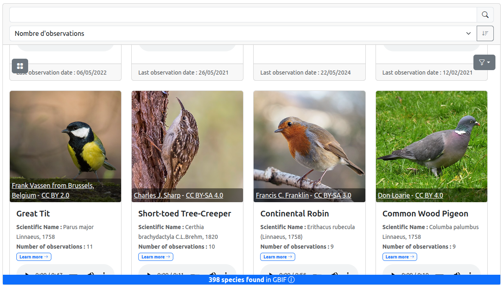

# Get Started

## Open the configurator

First, go to the following address : https://pnx-si.github.io/widget-gtsi/#/config

The following interface should appear:


The interface is divided in 4 parts :

1.  This block contains the widget parameters. First, this block enables to indicate the zone in which you are

    looking for species. Second, it allows you to customize differents parameters of your widget like the data source, the media source, the class

    of animal, the display mode, etc..

2.  This block shows you a preview of the widget as it will appear in your website/application.

3.  In default mode, the widget is separated into two blocks, one to display the zone location and the second to show the species listed in the latter.

4.  Allows you to change the language of GUI.

### You first widget

In the parameter block, draw a geometry (polygon, circle, line,...) in which you want to look for taxons.


You should see a loading indicator in the preview block followed by a list of taxons like in the screenshot below



You can change the style of the list by clicking on top left icon ☷ or ☰.


### Integrate the widget in your website

Use the `Share` button to open the following modal.


Then, copy the HTML code in your webpage.

```html
<html>
  <head>
    ...
  </head>

  <body>
    <div>
      <embed
        src="https://pnx-si.github.io/widget-gtsi/#/?radius=1&wkt=POLYGON


      ((6.056916750121133 44.57703998098364, 6.056876644804486


      44.577330104383925, 6.0567578484837306 44.57760907986982,


      6.0565649254490435 44.577866186335314, 6.056305288965714


      44.57809154297202, 6.055988916486816 44.578276489036675,


      6.0556279662605315 44.57841391674158, 6.055236310060284 44.578498544466,


      6.054829 44.57852711977936, 6.054421689939716 44.578498544466,


      6.054030033739469 44.57841391674158, 6.053669083513184 44.578276489036675,


      6.053352711034287 44.57809154297202, 6.053093074550957 44.577866186335314,


      6.052900151516269 44.57760907986982, 6.052781355195513 44.577330104383925,


      6.052741249878866 44.57703998098364, 6.0527813756283795


      44.576749859030905, 6.052900189271284 44.57647088766723, 6.05309312388026


      44.5762137873711, 6.053352764427941 44.57598843801162, 6.053669132842488


      44.575803499224214, 6.054030071494483 44.57566607768865, 6.054421710372583


      44.575581454086446, 6.054829 44.57555288022062, 6.055236289627418


      44.575581454086446, 6.055627928505517 44.57566607768865, 6.055988867157512


      44.575803499224214, 6.05630523557206 44.57598843801162, 6.05656487611974


      44.5762137873711, 6.056757810728716 44.57647088766723, 6.05687662437162


      44.576749859030905, 6.056916750121133


      44.57703998098364))&connector=gbif&nbTaxonPerLine=2&showFilters=true&mapEditable=true&lang=fr&mode=gallery&widgetType=default&GBIF_ENDPOINT=https://api.gbif.org/v1&mediaSource=gbif"
        type=""
        style="width: 100%; height: 500px;"
      />
    </div>
  </body>
</html>
```
