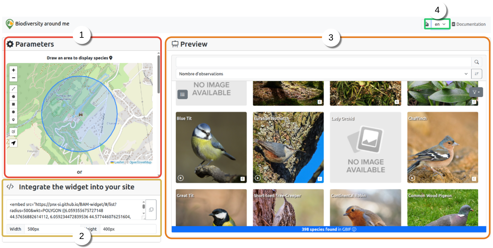
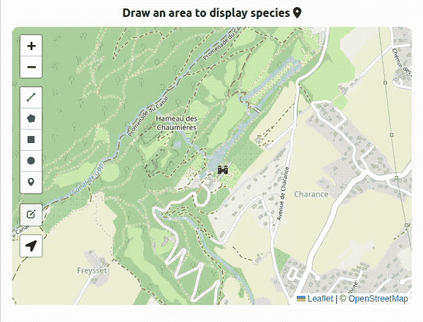

# Getting Started

## Open the Configurator

To begin, go to the following address: https://pnx-si.github.io/widget-gtsi/#/config.

The following interface should appear:



The interface is divided into five parts:

1. **Widget Parameters**: This section allows you to specify the area where to you want to search for species. In addition, various parameters may be changed such as: _data source_, _media source_, _taxon class_, _display mode_, etc.

2. **Export Embed Code**: This section allows you to export the `<embed>` code required to integrate the widget into your website.

3. **Widget Preview**: This section shows you a preview of the widget as it will appear on your website or application.

4. **Default Display**: By default, the widget is divided into two blocks: one to display the location of the area and the other to list the species present in that area. To change the display mode to `List` go to the parameters and change the `Widget display mode` setting.

5. **Language Change**: This section allows you to change the language of the user interface.

## Create Your First Widget

In the parameters block, draw a geometry (polygon, circle, line, etc.) in which you want to search for taxa.



You should see a loading indicator in the preview block, followed by a list of taxa, as in the screenshot below:


You can change the style of the list by clicking on the top left icon ☷ or ☰.


## Integrate the Widget into Your Website

In the bottom-left block of the interface, copy the HTML code.


Then, copy the HTML code into your webpage:

```html
<html>
  <head>
    ...
  </head>

  <body>
    <div>
      <embed
        src="https://pnx-si.github.io/widget-gtsi/#/?radius=1&wkt=POLYGON ((6.065733348121989 44.576553304564825, 6.0654911292327265 44.57830781799968, 6.064772991141251 44.57999495639761, 6.063606495426499 44.581549875401485, 6.062036445756115 44.58291280750781, 6.060123169780968 44.58403136085271, 6.057940202071561 44.584862534908495, 6.055571456941543 44.58537437527727, 6.053108 44.585547203637255, 6.050644543058457 44.58537437527727, 6.048275797928439 44.584862534908495, 6.046092830219032 44.58403136085271, 6.044179554243885 44.58291280750781, 6.042609504573501 44.581549875401485, 6.0414430088587485 44.57999495639761, 6.040724870767273 44.57830781799968, 6.040482651878011 44.576553304564825, 6.040725617998898 44.57479884406682, 6.041444389562768 44.57311185642028, 6.04261130855026 44.57155716303179, 6.044181506854287 44.57019449705699, 6.046094634195841 44.56907620984364, 6.04827717863253 44.56824526140327, 6.050645290290133 44.5677335717859, 6.053108 44.56756079636277, 6.055570709709867 44.5677335717859, 6.05793882136747 44.56824526140327, 6.060121365804159 44.56907620984364, 6.062034493145714 44.57019449705699, 6.06360469144974 44.57155716303179, 6.064771610437232 44.57311185642028, 6.0654903820011015 44.57479884406682, 6.065733348121989 44.576553304564825))&connector=GBIF&nbTaxonPerLine=1&showFilters=true&mapEditable=true&lang=fr&mode=gallery&widgetType=default&hybridTaxonList=true&GBIF_ENDPOINT=https://api.gbif.org/v1&LIMIT=300&NB_PAGES=10&soundSource=gbif&imageSource=wikidata"
        type=""
        style="width: 500px; height: 400px"
      />
    </div>
  </body>
</html>
```

It should the render the following widget :

<embed src="https://pnx-si.github.io/widget-gtsi/#/?radius=1&wkt=POLYGON ((6.065733348121989 44.576553304564825, 6.0654911292327265 44.57830781799968, 6.064772991141251 44.57999495639761, 6.063606495426499 44.581549875401485, 6.062036445756115 44.58291280750781, 6.060123169780968 44.58403136085271, 6.057940202071561 44.584862534908495, 6.055571456941543 44.58537437527727, 6.053108 44.585547203637255, 6.050644543058457 44.58537437527727, 6.048275797928439 44.584862534908495, 6.046092830219032 44.58403136085271, 6.044179554243885 44.58291280750781, 6.042609504573501 44.581549875401485, 6.0414430088587485 44.57999495639761, 6.040724870767273 44.57830781799968, 6.040482651878011 44.576553304564825, 6.040725617998898 44.57479884406682, 6.041444389562768 44.57311185642028, 6.04261130855026 44.57155716303179, 6.044181506854287 44.57019449705699, 6.046094634195841 44.56907620984364, 6.04827717863253 44.56824526140327, 6.050645290290133 44.5677335717859, 6.053108 44.56756079636277, 6.055570709709867 44.5677335717859, 6.05793882136747 44.56824526140327, 6.060121365804159 44.56907620984364, 6.062034493145714 44.57019449705699, 6.06360469144974 44.57155716303179, 6.064771610437232 44.57311185642028, 6.0654903820011015 44.57479884406682, 6.065733348121989 44.576553304564825))&connector=GBIF&nbTaxonPerLine=1&showFilters=true&mapEditable=true&lang=fr&mode=gallery&widgetType=default&hybridTaxonList=true&GBIF_ENDPOINT=https://api.gbif.org/v1&LIMIT=300&NB_PAGES=10&soundSource=gbif&imageSource=wikidata" type="" style="width: 500px; height: 400px" />
