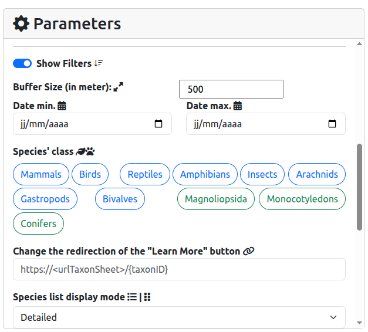
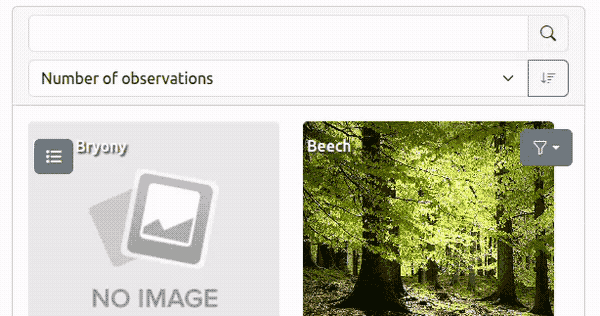
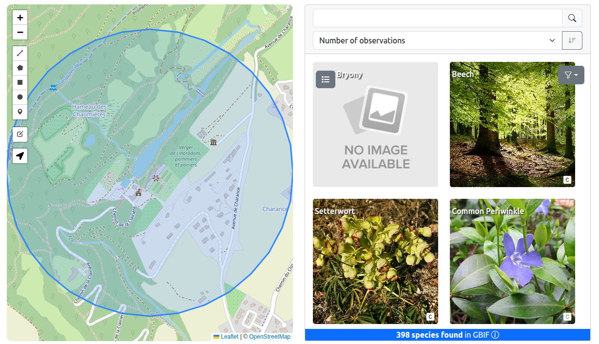

# Widget customization

There is two ways of customizing the widget:

- use the `Parameters` block in the configuration interface (available at `https://pnx-si.github.io/BAM-widget/#/config`)
  
- directly in the url of the existing `<embed>` tag.

## Parameters reference

### `radius` (**Type:** number)

Buffer radius for the search area in kilometers.

**Example:** `1`

### `wkt` (**Type:** string)

[Well-Known Text](https://fr.wikipedia.org/wiki/Well-known_text) geometry that defines the search area.

You can easily generate WKT [here](https://wktmap.com/).

- **Example :** `"POINT(2.35 48.85)"`

### `dateMin` and `dateMax` (**Type:** string)

Minimum observation date for filtering results.

- **Example:** `"2024-01-01"`

### `connector` (**Type:** string)

Specifies the data source connector, such as GBIF, GeoNature, etc.

**Available values:** `[GBIF, GeoNature]`

### `nbTaxonPerLine` (**Type:** number)

Number of taxa displayed per line in the list view.

- **Example:** `4`

### `showFilters` (**Type:** boolean)

Determines whether to show or hide filters in the taxon list.

### `mapEditable` (**Type:** boolean)

Allows or prevents editing of the geometry on the map.

### `lang` (**Type:** string)

Language code for the user interface.

**Language available:** `"en"`, `"fr"`

### `mode` (**Type:** string)

Display mode for the taxon list, either `gallery` or `detailedList`.

#### `gallery`

A simpler view focusing on the vernacular name, a picture and potentially a sound recorded of the animal.

#### `detailedList`

A detailed view for each taxon.

### `sourceGeometry` (**Type:** string)

A URL to a GeoJSON file that defines the selected area. The geometry is simplified due to URL character limits.

### `class` (**Type:** string)

Taxonomic class filter, such as Mammalia or Aves. For more details, check [taxonclass2icon.js](https://github.com/PnX-SI/BAM-widget/blob/main/src/assets/taxonclass2icon.js).

**Example / Values:** `"Mammalia"`

### `widgetType` (**Type:** string)

Display mode for the widget, with `default` being the standard option.

**Available Values:** `[default, list]`

#### Default mode

#### List

### `hybridTaxonList` (**Type:** boolean)

Enables switching between list and gallery display modes for taxa.

### `x` and `y` (**Type:** number)

Longitude and latitude for point geometry.

**Example:** `2.35`

### `customDetailPage` (**Type:** string)

Custom URL for redirecting to a taxon detail page. The taxon ID part of the URL must be indicated by the string `{taxonID}` so it can be replaced by the actual taxon's ID.

**Examples:**

- `https://https://www.gbif.org/species/{taxonID}`
- `https://inpn.mnhn.fr/espece/cd_nom/{taxonID}`

### `imageSource` (**Type:** string)

Name of the data source use to fetch taxa pictures.

**Available sources:**

- `wikidata` GBIF and GeoNature compatible
- `gbif` GBIF compatible
- `taxref` GeoNature compatible
- `taxhub` GeoNature compatible

### `soundSource` (**Type:** string)

Name of the data source use to fetch animal sounds.

- `gbif` (GBIF compatible)
