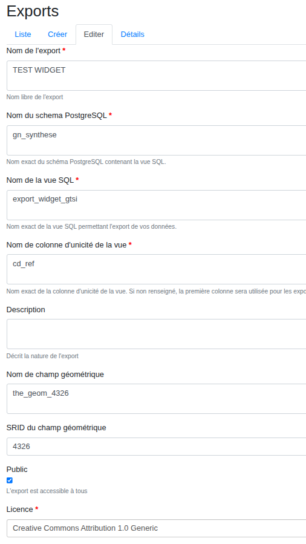

# Different observations data sources

## GBIF

The [**Global Biodiversity Information Facility (GBIF)**](https://www.gbif.org/) is an international network and research infrastructure aimed at providing open access to data about all types of life on Earth.

Thankfully, the GBIF allows anyone to query data through its [API](https://techdocs.gbif.org/en/openapi/).

### Usage

Since there is only one global endpoint in the API (`https://api.gbif.org/v1/occurrence/search/`), **no configuration is required**.  
There is just a default limit of number of requests done to the GBIF API (10 requests of 300 occurrences results) to limit the load on the API but also the calculation and loading duration of the results in the widget. You can change this limit but it can be to loud for the API or for the web browser if there is too much results to download and process.  
Indeed, based on occurrences (observations) resultats the widget will agregate them to provide a list of observed species.

## GeoNature

[GeoNature](https://geonature.fr/) is an open source software designed to manage and share biodiversity data. It is widely used for biodiversity data management and is particularly useful for natural parks, conservation organizations, and research institutions in France. GeoNature allows users to collect, store, and share data about species observations, habitats, biodiversity monitoring and more.

### Compatibility

BAM widget is compatible with GeoNature versions greater than or equal to 2.16.0. You must have the Export module installed (check the documentation [here](https://github.com/PnX-SI/gn_module_export?tab=readme-ov-file#installation-du-module))

### Setup your GeoNature

To set up your GeoNature instance to use with the widget, follow these steps:

1. **Go to Admin:**

   Log into your GeoNature admin panel.

2. **Create an Export (Public):**

   You need to create a **public** export in your GeoNature instance.

   1. First, you need to create a view in your database that will be used to export data for the widget.

      The data returned by your view must have the following fields:

      - `cd_ref`: Taxon id in the Taxref referential
      - `nom_vernaculaire`: Vernacular name
      - `nom_scientifique`: Scientific name
      - `date_min` `date_max`: Minimum and maximum date of an observation
      - `the_geom_4326`: the geometry of the observation (required to compare the selected area)

      You can use the following SQL code to create the view:

      ```sql
      CREATE OR REPLACE VIEW gn_exports.bam_widget AS
      SELECT
         t.cd_ref AS cd_ref,
         t.nom_vern AS nom_vernaculaire,
         t.lb_nom AS nom_scientifique,
         s.date_min AS date_min,
         s.date_max AS date_max,
         bl.geom AS the_geom_4326,
         t.classe AS classe
      FROM gn_synthese.synthese s
      join taxonomie.taxref t using(cd_nom)
      ```

      **Notes**: Feel free to modify this view depending on your needs! You can filter data with a `where` clause in the view, but keep the view data structure.

   2. Once your view is created, type the information in the export creation form in GeoNature.

      

3. **Set the export information in the widget generator:** Recover the newly export ID. Then, in the widget configuration interface, click on the `Change the data source` button. The following window should appear.

   

   Choose "GeoNature" in the `Select a data source` field. Enter the API endpoint of your GeoNature (usually, your GeoNature web address followed by `/api`). Indicate the ID of your export and validate by clicking on the `OK` button.
